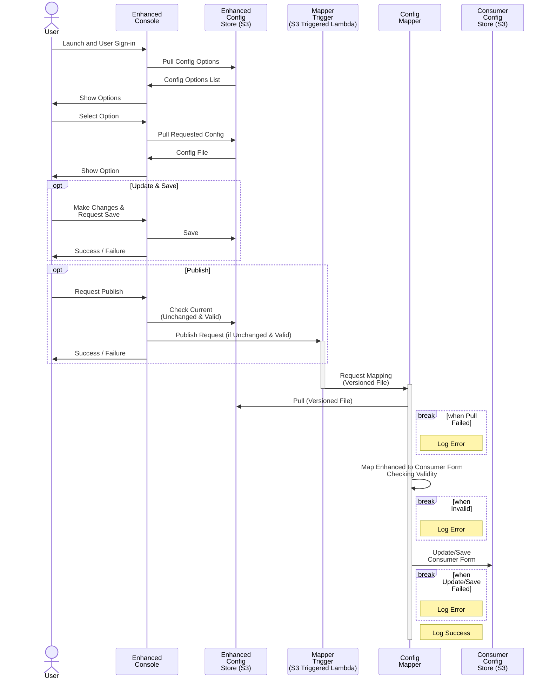
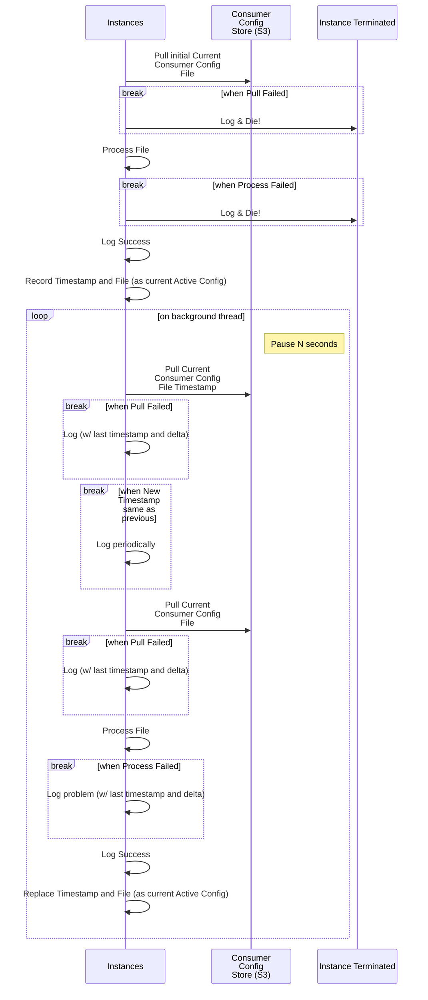

# FeatureFlags
Commentary/Thoughts on Feature Flags 

Feature Flags can be categorized on three dimensions:
1. How often will it need to deliver different outcomes based on context changes (e.g. by user / organization / groupings) -- its **dynamism**.
2. Who (role) should be responsible for managing the flag -- its **ownership**.
3. How long will it have to exist (creation thru removal) -- its **longevity**.  The Types below are placed in one of the following longevity buckets:
   1. Short-term
   2. Medium-term
   3. Long-term
   4. Permanent

Each type of Flag should support: 
* Activation Limited based on Random Users (percentage), or User Groups: By user characteristics &/ companies (supports Progressive/Ring deployments)
* Activation Limited based on Environment: Dev, QA, UAT, Prod-Group1, Prod-Group2
* Expiration Dates (except permanent ones: *Safety_Valves*, *DevOps_Controls*, & possibly *Permissioning*)

## Types of Flags:

1. **Experiment** (A/B Enhancement Testing): Short-term (It is nice to allow users to opt-out of the testing -- if testing a proposed improved user experience -- this option can be inappropriate, e.g. statistic based testing for engagement enhancement).
2. **Release** (New Feature): Medium-term (often heavily Environment based)
3. **Sunsetting** (Old Feature): Medium-term
4. **Permissioning** (Custom Feature Disablement/Enablement) (e.g. Newbie vs Power User, Detail Level of Errors, or Free Trials): Long-term (possibly permanent)
>DevOps Group (some web based documentation just referred to this as *Ops*):
5. **Migration_Support** (behaviour same -- code changed): Short-term
6. **Safety_Valves** (Circuit Breakers / Kill Switches / Maintenance Window Shutdown Warnings): Permanent
7. **DevOps_Controls** (e.g. Logging Level, e.g. *off*, *minimal*, *regular*, & *verbose*): Permanent (until the "code area" is removed) -- Give that there are at least 3 likely options, were left with either a "Multivariate Flag" or a flag with text data or multiple flags (which then raises the question of the overhead of flag access), note two binary flags: LoggingEnabled, LoggingVerbose; get us to 3 of the 4 above options.

> Note: The flags should be grouped in multiple Enums based on some combination of: *Types*, *dynamism*, *ownership*, and *longevity*
>
> If we don't have the ability to automatically have the flag name include the Enum type name, it is recommended that for each flag in the config files have a "label" that indicates the Enum type (simple) name. 
>
> If we build our own system, then the actual flag name should probably be the combination: {Enum type simple name}.{Enum entry name}

### General Questions:

* Do we need "Multivariate Flags" (non-binary, e.g. Logging with multiple options: *off*, *minimal*, *regular*, & *verbose*)?
* Who are the stakeholders besides developers? (Ops, Product, Business, Sales, etc)
* Do we need scheduled flag change
* With "expiration dates" on most of the flags, should we create "time bombs" which will fail a test if a feature flag is still around after its expiration date.
* ...

### Custom Built/Augmentation Questions:

* Should we support "Group Control Flags"? -- Flags that are not visible to the code, but reference a Group of other (binary) flags AND forces all the Group members to have the same value as the Group Control Flag (by definition a binary flag).
* Should we support "Cascading Flags"? -- “This flag is evaluated only if another flag is true.”
* Do we need both scheduled timed release of flag changes and emergency release (minimize flag value variation in production)? 
* ...

### Architectural Options: 

#### How Togglz (appears) to manage flags:

1. Its "console" manages flags individually (all the **StateRepository**(s) must support CRUD on individual flags) -- they do not support either "Group Control Flags" or "Cascading Flags" (and the human logistics of managing either of these inter-flag relationships seems unreasonable).
2. Since the "console" is IN the library and hence in the application, this means that its availability is as high as the number of instances, but also means that the application footprint is that much larger AND the application must support "people" access (which from a pure Rest-ish service perspective, seems unreasonable).
3. Because of the assumption that any individual flag can be changed at any time, the processing of each request must reevaluate any of the parameters of the flag (e.g. parsing the list of IP address or usernames for the **Percent** and **Ring** deployment **Strategies**).
4. The **StateRepository**(s) with multi-app-instance access come in a number of types: **S3** (GCP and AWS), **Key-Value** (NoSql: GCP and Mongo), **SQL**, **Distributed-Memory** (Memcache & Redis).  From a speed perspective, the *Distributed-Memory* model would be **first**, and *S3* **last**.  However, from a consistency, resilience, and Ops perspective, *S3* would be **first**, and the *Distributed-Memory* model **last**. 

#### Proposed changes to Togglz:

1. Refactor the code to support running the "console" as either embedded (current model) or as a stand-alone application.
2. With the stand-alone "console", we can introduce a new model for managing the flags:
   1. By splitting the flag storage into two parts: a *human* layer and an *application consumption* layer.
   2. A library added to the stand-alone "console" that maps the "*human* layer" into the "*application consumption* layer", with validation and enhanced types: "Group Control Flags", "Cascading Flags", "Dependency Flags" (like a reverse Group Control flag -- see Harness' Prerequisites), tightly controlled (enums) variants for "Multivariate Flags", and *easier support for mutability / visibility based on **ownership** roles* (could also be used to *nag* about expired flags).
   3. Add a new **StateRepository** for the "*application consumption* layer" that does not support updating and is backed by an **S3** Object that polls periodically and on change does the parsing (based on the **Strategy**) of the supporting data (reducing the time overhead per request) before swapping in the *current* values. Since this new **StateRepository** is effectively two processes, the mapper and the server, new functionality can be added here also, such as "Scheduled Activation" (to minimize the variation of polling and processing times for each application instance).
   4. Since **S3** buckets are essentially "free" (you pay for what is in them, not how many buckets you have -- "standard" option -- AWS, CGP, & Azure), two buckets for each application could be used: one for the "*human* layer" version and one for the "*application consumption* layer" so each can have different permissions.
   5. Others...:
      1. Add MS Teams Channel/Chat notifications.
      2. Support Flags being targeted for UI (so they can be requested by the UI).

### Sequence Diagram showing interactions and processes between the Users and the S3 Consumer Bucket:

### Sequence Diagram showing interactions and processes between the Applications (instances) and the S3 Consumer Bucket:

### Interesting websites:

Feature Flag Glossary: https://featureflags.io/feature-flag-glossary/

See Graphs: https://martinfowler.com/articles/feature-toggles.html

Neal Ford on Feature Toggles/Flags: http://radar.oreilly.com/2015/03/how-ci-removes-the-pain.html